# Hello iOS
**Prerequisites**: please make sure you have installed all necessary software. [Instructions](https://github.com/XpiritBV/xamarin-hands-on-labs/#getting-started).

## Objectives
- Build your first app with Xamarin.Android

## Exercise 1: Basic navigation
### Instructions
Create a new iOS/iPhone project in Visual Studio 2017: `File > New Project > iOS > Blank App (iPhone)` or in Visual Studio for Mac: `File > New Solution > iOS > Blank iOS App`.

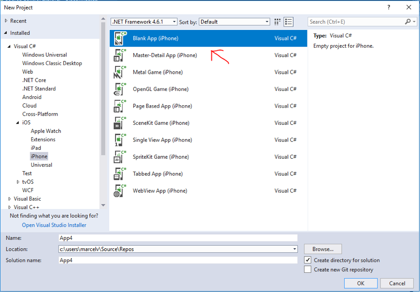

Add iPhone Storyboard View Controller:

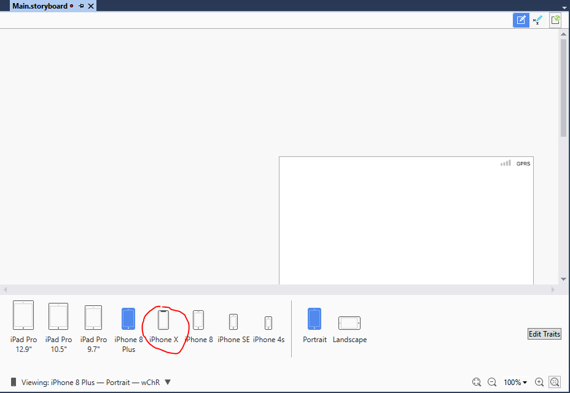

Open the storyboard file. Add a new `ViewController` to the canvas by selecting the `ViewController` in the toolbox and dragging it onto the canvas.

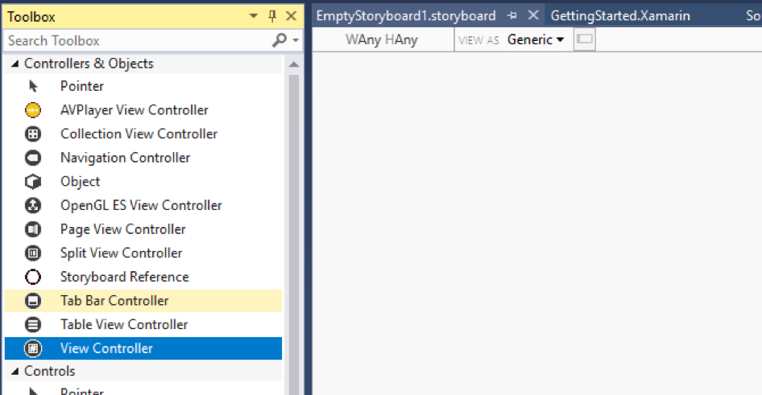

Change the view of the canvas to show the view as on the iPhone 6, 7 or 8 (depending on the SDK you have installed).

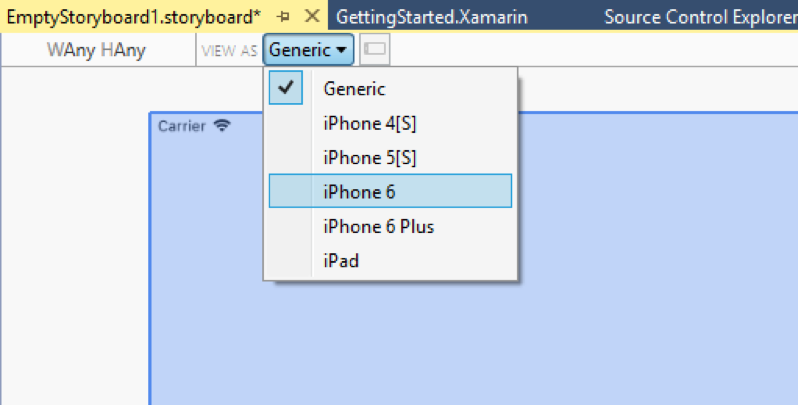

From the toolbox add a `Button` to the `ViewController`.


Change the `Title` property to “click me please”.


Your storyboard should look as follows:

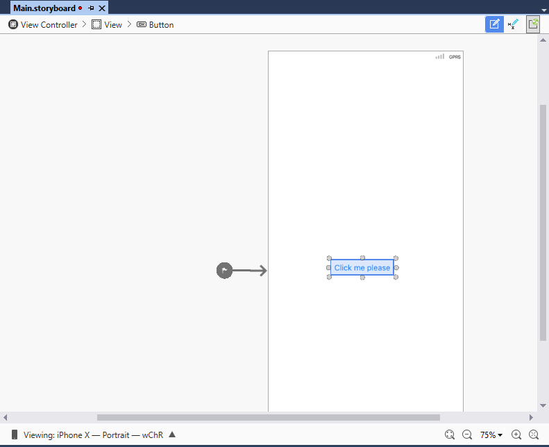

Add a new `ViewController` that we will show when we click the button:	

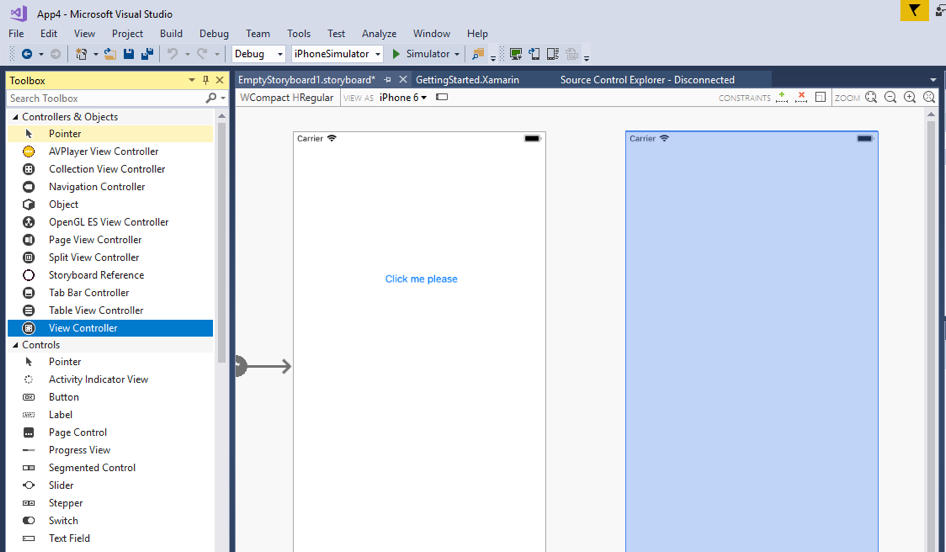

Give the `ViewController` a `Label` with text so we can see we are on a second page:

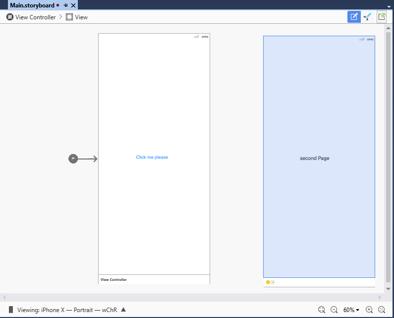

Now select the button and hold the `CTRL` or `Command` key. Then drag from the button to the second `NavigationController`. When you release the mouse button, select the option for the `Action Segue` **“Modal”**. In `AppDelegate.cs`, make a code change where we add a `Window Property` like this:

```csharp
UIWindow _window;

public override UIWindow Window
{
    get { return _window;}
    set { _window = value; }
}
```

And we **comment out** the method: `FinishLaunching`. Now go to the `info.plist` file and select our storyboard file as the startup. This will now wire up the storyboard as the main UI.

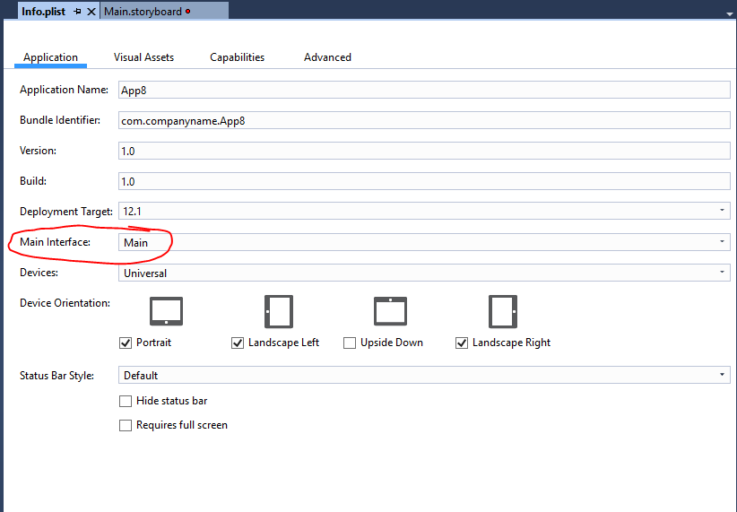

Now build the solution and run it in the simulator. Now after we click the button we see the second page, but we don’t have a way to navigate back. So let’s fix this.

Go to the second page on the story board and add an additional `Button`.

Now we need to add some code behind the click of the button. In order to make this work you need to first select the NavigationController, by clicking in the bottom dark bar in the storyboard designer for the `ViewController`:

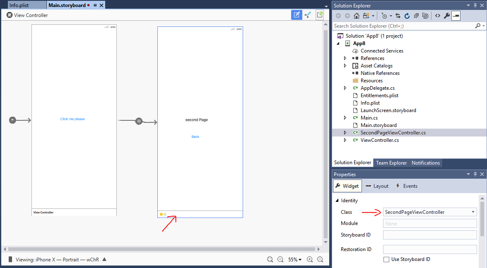

Now first give the `ViewController` a class name, this will generate code for the class in your project. (it will add a class).

Now select the button again and also give it a name:

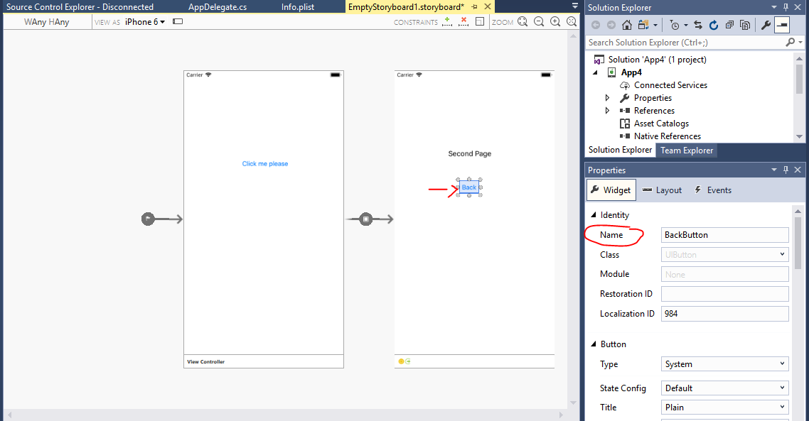

 Now double click the button, since it now has a code behind, it will jump to the event handler for this button. There we add the following statement to dismiss the modal `ViewController`:

 ```csharp
DismissModalViewController(true);
 ```

Run the application and see you can now navigate between the two windows.

## Exercise 2: TableViewController
### Instructions

Create a new project called vslivedemo2.
Select empty iOS application:

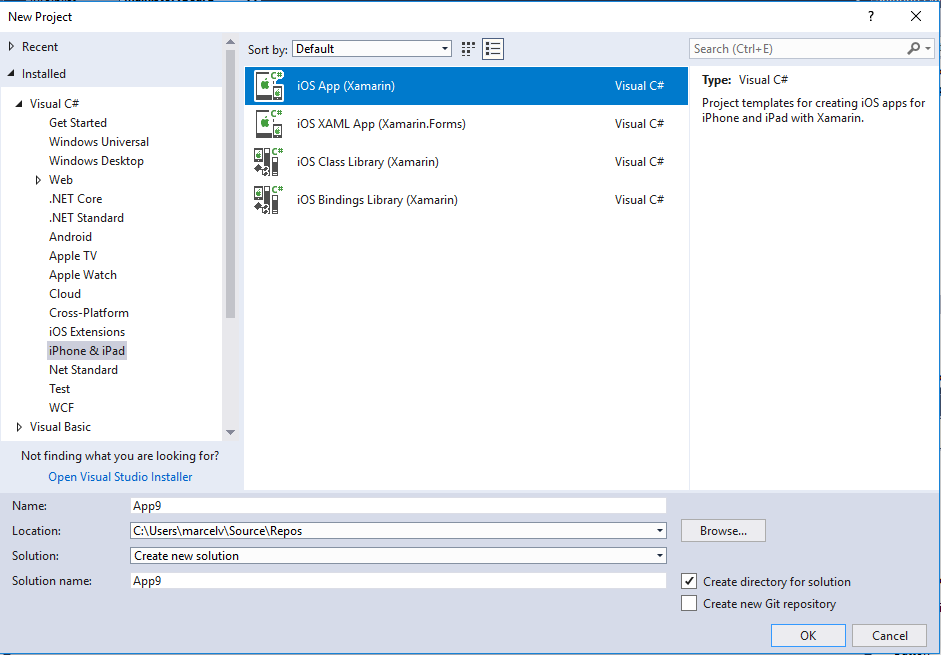

Add a new storyboard to the project: 


When you get a message to trust the template, click on the trust button, so the template can be used.


 Drag from the toolbox a new `Navigation Controller`. The storyboard looks like follows when done:

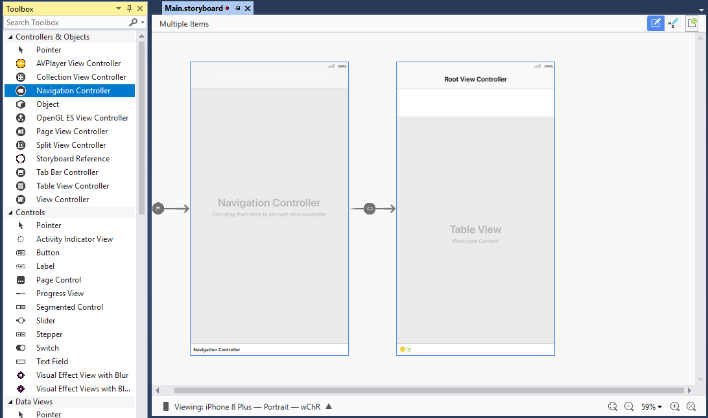

Make the same changes in the `AppDelegate` and the `info.plist` files so we can load up the storyboard, just as done in the first exercise.

Test the project in the simulator and see if it runs. 

By default we got as the startup screen the table view controller, so next is some code so we can fill the table with some data.

Select the `Table View Controller` and now go to the class properties and give it the name `CitiesTableViewController`, so we get a code behind class where we can code the initialization of the table.

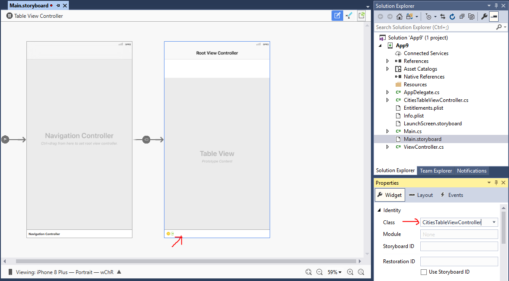

Now add a new class to the project called `CitiesTableViewSource`. Inherit this class from a `UITableViewSource`. Next implement the abstract interface:

```csharp
public class CitiesTableViewSource : UITableViewSource 
{
  public override UITableViewCell GetCell(UITableView tableView, NSIndexPath indexPath)
  {
    throw new NotImplementedException();
  }

  public override nint RowsInSection(UITableView tableview, nint section)
  {
    throw new NotImplementedException();
  }
}
```

`GetCell` is called for each cell in the table and serves as a cell factory. The `RowsInSection` method is called to determine the number of rows in the table.

Copy the following code for the implementation of the `CitiesTableViewSource`:

```csharp
public class CitiesTableViewSource : UITableViewSource
{
    List<String> _citiesList = new List<string>();
    private const string CITYCELL = "CityCell";
    public CitiesTableViewSource()
    {
        _citiesList.Add("New York");
        _citiesList.Add("San Francisco");
        _citiesList.Add("Redmond");
        _citiesList.Add("Las Vegas");
        _citiesList.Add("Chicago");
        _citiesList.Add("Orlando");
    }

    public override UITableViewCell GetCell(UITableView tableView, NSIndexPath indexPath)
    {
        var cell = tableView.DequeueReusableCell(CITYCELL);
        if(cell == null)
            cell = new UITableViewCell(UITableViewCellStyle.Default, CITYCELL);

        cell.TextLabel.Text = _citiesList[indexPath.Row];
        return cell;
   }

   public override nint RowsInSection(UITableView tableview, nint section)
   {
       return new nint(_citiesList.Count);
   }
}
```

And now hook up this table view source to the `TableViewController`. This is done by overriding the `ViewDidLoad` method:

```csharp
public override void ViewDidLoad()
{
    base.ViewDidLoad();
    this.TableView.Source = new CitiesTableViewSource();
}
```

# Congratulations!
You've built your first Xamarin.iOS app.