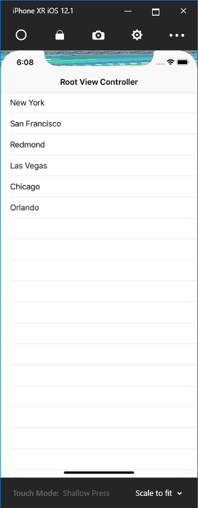
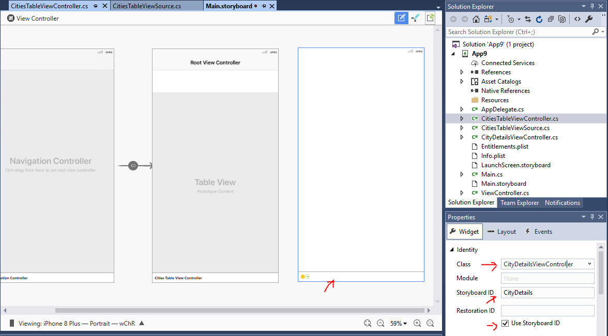
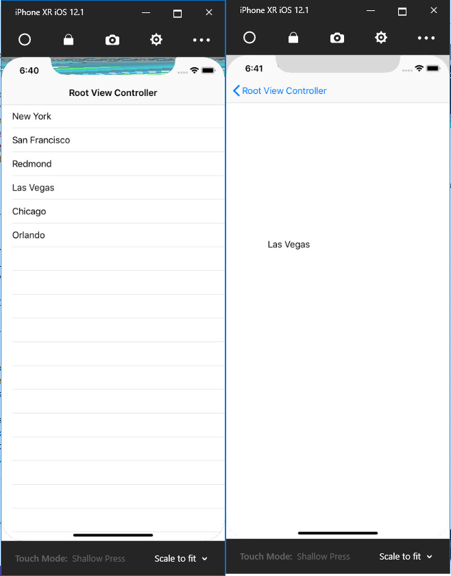

# Hello iOS
**Prerequisites**: please make sure you have installed all necessary software. [Instructions](https://github.com/XpiritBV/xamarin-hands-on-labs/#getting-started).

## Objectives
- Build your first app with Xamarin.IOS

## Exercise 1: Basic navigation
### Instructions
Create a new iOS/iPhone project in Visual Studio 2017: `File > New Project > iPhone & iPad > iOS App (Xamarin) and on the next screen Single view App` or in Visual Studio for Mac: `File > New Solution > iOS > Single View App`.


Open the storyboard file Main.Storyboard. 

Change the view of the canvas to show the view as on the iPhone .


On the canvas you see A view Controller that contains a view.

From the toolbox drag a `Button` to the `ViewController`and drop it there.


Next change the `Title` property to “click me please”.


Your storyboard should look as follows:


Add a new `ViewController` that we will show when we click the button:	


Give the `ViewController` a `Label` with text so we can see we are on a second page:


Now select the button and hold the `CTRL` or `Command` key. Then drag from the button to the second `ViewController`. When you release the mouse button, select the option for the `Action Segue` **“Show”**. 

Now check that in the Info.plist the main interface is selected to be Main


Now build the solution and run it in the simulator. Now after we click the button we see the second page, but we don’t have a way to navigate back. So let’s fix this.

Go to the second page on the story board and add an additional `Button`.

Now we need to add some code behind the click of the button. In order to make this work you need to first select the NavigationController, by clicking in the bottom dark bar in the storyboard designer for the 2nth `ViewController`:


Now first give the `ViewController` a class name, this will generate code for the class in your project. (it will add a class).

Now select the button again and also give it a name:


 Now double click the button, since it now has a code behind, it will jump to the event handler for this button. There we add the following statement to dismiss the `ViewController`:

 ```csharp
    partial void BackButton_TouchUpInside(UIButton sender)
    {
        this.DismissViewController(true, null);
    };
 ```

Run the application and see you can now navigate between the two windows.

## Exercise 2: TableViewController
### Instructions

Create a new project called vslivedemo2.
Select empty iOS application:


Open the Story Board Main.Storyboard and delete the exisiting viewcontroller so the storyboard is empty.

Next you drag from the toolbox a new `Navigation Controller`. The storyboard looks like follows when done:


Test the project in the simulator and see if it runs. 

By default we got as the startup screen the table view controller, so next we need to write some code to fill the table with some data.

Select the `Table View Controller` and now go to the class properties and give it the name `CitiesTableViewController`, so we get a code behind class where we can code the initialization of the table.


Now add a new class to the project called `CitiesTableViewSource`. Inherit this class from a `UITableViewSource`. Next implement the abstract interface:

```csharp
public class CitiesTableViewSource : UITableViewSource 
{
  public override UITableViewCell GetCell(UITableView tableView, NSIndexPath indexPath)
  {
    throw new NotImplementedException();
  }

  public override nint RowsInSection(UITableView tableview, nint section)
  {
    throw new NotImplementedException();
  }
}
```

`GetCell` is called for each cell in the table and serves as a cell factory. The `RowsInSection` method is called to determine the number of rows in the table.

Copy the following code for the implementation of the `CitiesTableViewSource`:

```csharp
public class CitiesTableViewSource : UITableViewSource
{
    List<String> _citiesList = new List<string>();
    private const string CITYCELL = "CityCell";
    public CitiesTableViewSource()
    {
        _citiesList.Add("New York");
        _citiesList.Add("San Francisco");
        _citiesList.Add("Redmond");
        _citiesList.Add("Las Vegas");
        _citiesList.Add("Chicago");
        _citiesList.Add("Orlando");
    }

    public override UITableViewCell GetCell(UITableView tableView, NSIndexPath indexPath)
    {
        var cell = tableView.DequeueReusableCell(CITYCELL);
        if(cell == null)
            cell = new UITableViewCell(UITableViewCellStyle.Default, CITYCELL);

        cell.TextLabel.Text = _citiesList[indexPath.Row];
        return cell;
   }

   public override nint RowsInSection(UITableView tableview, nint section)
   {
       return new nint(_citiesList.Count);
   }
}
```

And now hook up this table view source to the `TableViewController`. This is done by overriding the `ViewDidLoad` method:

```csharp
public override void ViewDidLoad()
{
    base.ViewDidLoad();
    this.TableView.Source = new CitiesTableViewSource();
}
```
Now build and run the application. If you implemented all without errors, your application should look as follows:



## Exercise 3: Navigation on selection
### Instructions

Now we want to implement that the moment we click on one of the cells, we navigate to a details page, that shows the name of the city.

In the storyboard, first add a new ViewController. Give it the name CityDetailsViewController.

We are going to load this page from code, therefore we need to provide an identifier to the view controller, so we can load it from the storyboard. For this you set the StoryBoardID.

This should look as follows:


On the CityDetailsViewController add a label, that we can set the moment the page loads. 

Now goto the CityDetailsViewController.cs file and there add to the class a property that can be set, which contains the city name to display. We will set this name, after we load the viewController from the storyboard and in the load of the page we then set the text label to display the name of the property.

The class should look like this:

``` csharp
public partial class CityDetailsViewController : UIViewController
{
    public string CityToDisplay { get; set; }
    public CityDetailsViewController (IntPtr handle) : base (handle)
    {
    }

    public override void ViewDidLoad()
    {
        txtCity.Text = CityToDisplay;
    }
}
```
Next we need to hook-up the touch handler in the cells. For this we can implement an override function `RowSelected`. YOu override this function in the CitiesTableViewSource we created in the previous excersise.

In the handling of the selection of the cell, we then load from the Main.Storyboard file the Details View controller. Then we assign the propoerty of the details controller the selected value and we then display it. To display the new view controller we also need access to the TableViewController, that is displaying the row of cities. For this we change the constructor to accept a ViewController as input and we save it in a private field with the name `_parent`


The next code will do the job:
``` csharp
//constructor:
private UIViewController _parent;
public CitiesTableViewSource(UIViewController parent)
{
    _citiesList.Add("New York");
    _citiesList.Add("San Francisco");
    _citiesList.Add("Redmond");
    _citiesList.Add("Las Vegas");
    _citiesList.Add("Chicago");
    _citiesList.Add("Orlando");
    _parent = parent;
}
//RowSelected override
public override void RowSelected(UITableView tableView, NSIndexPath indexPath)
{
    var storyboard = UIStoryboard.FromName("Main", null);
    var detailsViewController = storyboard.InstantiateViewController("CityDetails") as CityDetailsViewController;

    detailsViewController.CityToDisplay = _citiesList[indexPath.Row];

    _parent.ShowViewController(detailsViewController, this);
}
```
the final change is the fix of calling the constructor of `CitiesTableViewSource` since it now requires a parent reference. Change the line to now pass in the `this` pointer. 

Compile and run the application. If all went well, you should now be able to navigate when clicking a cell and because we use the navigationViewController, the back button is arranged automaticaly when we show the details viewcontroller.



# Congratulations!
You've built your first Xamarin.iOS app.