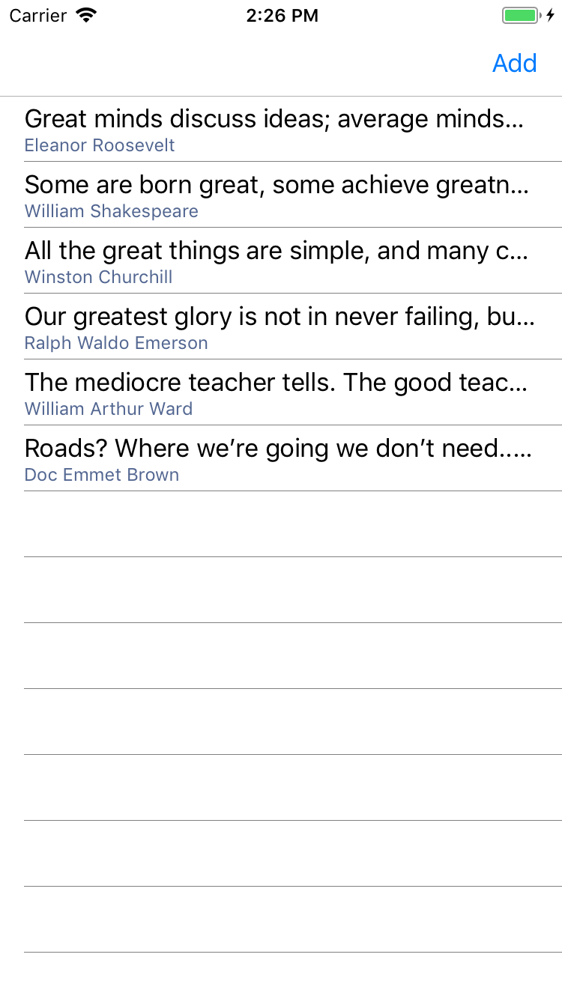
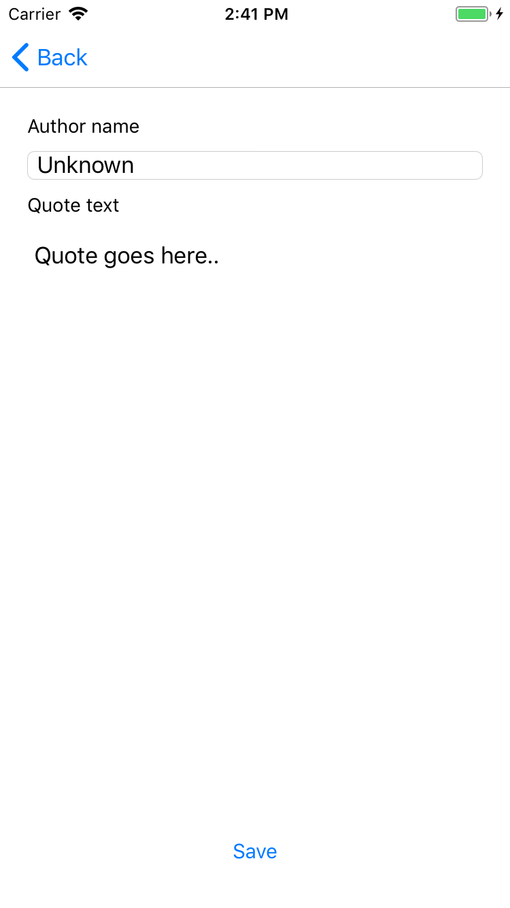
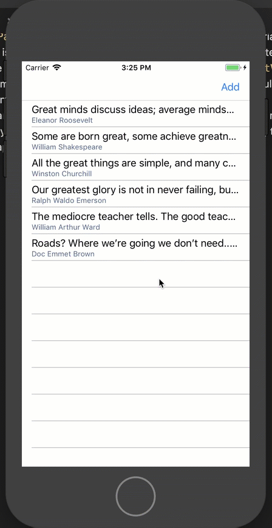

# Lab03: Editing capabilities for Quotes
In this lab, we're going to add capabilities for manipulating the list quotes or adding new quotes. You will explore how you can tap into some of the built in features of Xamarin.Forms `ContentPage` and `ListView` to facilitate this.

**Prerequisites**: please make sure you have installed all necessary software. [Instructions](https://github.com/XpiritBV/xamarin-hands-on-labs/#getting-started).

## Objectives
- Create a page for adding new quotes
- Reuse this page for editing existing quotes
- Leverage `ContextItem`s on `ListView` for deleting a quote

## Exercise 1: Adding new quotes
We're going to use the `ToolbarItems` feature on the Xamarin.Forms `ContentPage` to include a button that lets the user add new quotes. After this exercise, the `MainPage` will look like this:



Notice the new **Add** button in the top right corner.

1. Go to `MainPage.xaml`.
2. Add a `ToolbarItem` to the content page. This is done by adding items to the `ToolbarItems` collection that is available by default on the `ContentPage` class. In the top of the XAML code file, right inside the `<ContentPage ...>` opening tag, add the following:
    ```xml
    <ContentPage.ToolbarItems>
        <ToolbarItem Text="Add" Clicked="AddQuote" />
    </ContentPage.ToolbarItems>
    ```
3. Note that you can set a text that is displayed on the button, and that you can provide a handler for the `Clicked` event for this item. There are other properties, e.g. an `Icon` you can provide, or `IsDestructive`, to indicate if this toolbar command represents a _destructive_ command, such as deleting an item. iOS for example will render these _destructive_ items in red instead of the default button color. In this case, we just stick to these two simple properties `Text` and `Clicked`.
4. In the code behind `MainPage.xaml.cs`, implement the `Clicked` handler, which we named `AddQuote`. We want it to open a page which lets the user enter an author and quote text. It should look like this:
    ```csharp
    async void AddQuote(object sender, System.EventArgs e)
	{
	    await Navigation.PushAsync(new EditQuotePage());
	}
    ```
5. Notice that Visual Studio doesn't recognize this `EditQuotePage` class, since we still have to create this page. Let's do this right now.
6. Add a new XAML page to the `Quotes` project and name it `EditQuotePage`. Using your previous experience, try to recreate the following look:



7. How would you create this layout? _Hint: there are `Label`s, a `Button` and the text entry controls are an `Entry` control for single line input and an `Editor` for multi-line text input_. Peek in the `Completed` solution in this lab for the final solution.
8. As in the previous exercises, make sure that `EditQuotePage` has a `Quote` to serve as its `BindingContext` and to which we can databind the editing controls. Find the class constructor in `EditQuotePage.xaml.cs` and add your code to create a new instance of `Quote` and set it as the `BindingContext`. It should look like this:
    ```csharp
	public EditQuotePage() 
	{
	    BindingContext = new Quote();
	    InitializeComponent();
	}
    ```
9. When the user clicks **Save**, the app has to add the new quote to the `QuoteManager.Instance.Quotes` collection. Remember that the quotes collection is automatically saved when the app goes to the background. Add a handler to the `Clicked` event of the save button and implement it. The handler should add the new quote to the collection and navigate back to the previous page. Navigating back is done through the `Navigation.PopAsync(...)` method. The handler should look like this:
    ```csharp
    async void SaveQuote(object sender, System.EventArgs e)
	{
        QuoteManager.Instance.Quotes.Add((BindingContext as Quote));
        await Navigation.PopAsync();
	}
    ```
10. Run the app. You should now be able to add new quotes.

Well done!

Bonus question: when you add a new quote, it shows up automatically in the `ListView`. How does the `ListView` know this?

_Answer: `QuoteManager.Quotes` is an `ObservableCollection<T>`, which emits events when you add or delete items, to which `ListView` subscribes. Cool huh?_

## Exercise 3: Editing existing quotes
1. Using the knowledge gained in the previous exercise, you should now be able to add an editing feature for existing quotes. With a few tweaks, we should be able to reuse the `EditQuotePage`, so that it's able to distinguish between adding a new quote, or editing an existing one. You should initiate the edit feature from the `QuoteDetailPage`, via a `ToolbarItem`, as seen in this screen recording:


2. Try to find out for yourself how you would implement this feature, or look in the `Completed` solution for the answer. Some hints:
    - When editing a quote, it should only update the quote if you press **Save**, not when you navigate back by pressing the **Back** button.
    - The `Quote` class has a constructor overload which can create a copy of an existing `Quote`. You can use this to create a _working copy_.
    - Use a constructor parameter in `EditQuotePage` to pass in an existing `Quote` and for distinguishing between "editing existing items" or "adding new ones" modes.

Good luck! :)

## Exercise 4: Deleting items via context items
`ListView` offers more exciting features for manipulating or displaying items. In this exercise, we're going to use a `ContextAction` to each cell to trigger a _delete_ feature.

1. Open `MainPage.xaml` and find the `TextCell` declaration inside the `ListView`s `DataTemplate`. Inside the `<TextCell>` tag, add a `MenuItem` for the _delete_ action to its `ContextItems` collection. The text should be "Delete" and it should be rendered with a distinctive color to indicate a dangerous, or destructive, action. When clicked, it should invoke a handler that performs the actual deletion. The declaration should look like this:
    ```xml
    <TextCell ...>
        <TextCell.ContextActions>
            <MenuItem Clicked="OnDelete"
                CommandParameter="{Binding .}"
                Text="Delete"
                IsDestructive="True" />
        </TextCell.ContextActions>
    </TextCell>
    ```
2. Notice the `CommandParameter` attribute in the XAML snippet above. Its value is `"{Binding .}"`. The dot (.) is short hand for "the current item in the collection", i.e. the binding context of this particular `TextCell` instance, which is a `Quote` object. By binding the `CommmandParameter` to this value, we are able to know which quote the user wants to delete.
3. Implement the `OnDelete` handler in the `MainPage.xaml.cs` code behind. It should find out which quote to delete, and remove it from the `QuoteManager.Instance.Quotes` collection. The code should look like this:
    ```csharp
    void OnDelete(object sender, System.EventArgs e)
	{
	    if (sender is MenuItem item && item.CommandParameter is Quote quote)
	    {
		    QuoteManager.Instance.Quotes.Remove(quote);
	    }
	}
    ```
4. Have a closer look at the `if` statement in this code snippet. It uses C# 7 pattern matching to find out if the source of the click event is a `MenuItem` and directly casts it into a variable named `item`. In the second part of the `if` condition, it inspects whether the `CommandParameter` is a `Quote` and directly casts it to a local variable named `quote`. If this is all true, we know which quote the user wants to delete, and we can easily remove it from the `Quotes` collection. Remember that our `ListView` subscribes to add and remove events in the `ObservableCollection`, so it should automatically disappear from the list.
5. Run the app and test if you can delete items by revealing the context menu. On iOS, this is done by swiping items from right to left. On Android and UWP, this is done via a _long press_ (tap and hold).



This completes Lab03. Well done!

Next up: [Lab04](../Lab04/readme.md)
