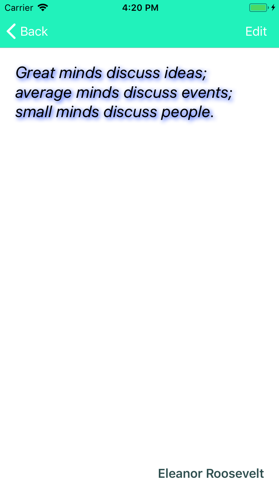

# Lab04: Tapping into native features
In this lab, we will spice up our app a little bit by tapping into native features and rendering. For this, we will explore a couple of ways in which Xamarin.Forms helps us break through the abstractions that it offers.

**Prerequisites**: please make sure you have installed all necessary software. [Instructions](https://github.com/XpiritBV/xamarin-hands-on-labs/#getting-started).

## Objectives
- Tweak the platform themes to customize look and feel
- Add an effect to customize the quote label
- Add a speech engine to speak out the quotes

## Exercise 1: Platform themes
In this exercise, you will explore how to customize the platform themes to change the visual appearance of your app.

1. Open the `Starter` solution, or continue working in your copy of the app.
2. Find the `AppDelegate.cs` file in the iOS project, or the `resources/values/styles.xml` file in the Android project.
    - iOS: in the `FinishedLaunching` method, try some of the ways you can change the default appearance of e.g. the navigation bar. An example:
    ```csharp
        UINavigationBar.Appearance.BarTintColor = UIColor.FromRGB(33, 242, 187);
        UINavigationBar.Appearance.TintColor = UIColor.White;
    ```
    - Android: in the `styles.xml` file, change some of the colors of the default theme, for example:
    ```xml
    <item name="colorPrimary">#21F2BB</item>
    ```
3. Run the app and see how the controls and colors you changed through the platform themes are taken over and made visible by Xamarin.Forms.

## Exercise 2: Creating an effect
In this exercise, we will use an `Effect` to add a drop shadow to the quote label on the `QuoteDetailPage`. The end result should look like this:



1. First, we will add the effect to our shared code. Add a new class named `ShadowEffect` to the `Quotes` project. The class should inherit from `RoutingEffect` (in the `Xamarin.Forms` namespace) and it should support properties like `Radius`, `Color`, `DistanceX` and `DistanceY`. It should look like this:

    ```csharp
    using System;
    using Xamarin.Forms;

    namespace Quotes.Effects
    {
        public class ShadowEffect : RoutingEffect
        {
            public float Radius { get; set; }
            public Color Color { get; set; }
            public float DistanceX { get; set; }
            public float DistanceY { get; set; }

            public ShadowEffect() : base("MyCompany.LabelShadowEffect")
            {
            }
        }
    }
    ```
2. Note that the constructor should to call the `base` constructor with the fully qualified logical name of the effect as a parameter. In this case `MyCompany.LabelShadowEffect`.
3. Attach the effect to the quote label in the `QuoteDetailPage.xaml` file, inside the `<Label ...>` tag:
    ```xml
    <Label ...>
        <Label.Effects>
            <ef:ShadowEffect Color="Blue" DistanceX="2" DistanceY="2" Radius="10" />
        </Label.Effects>
    </Label>
    ```
4. Note that the `<ef:ShadowEffect .../>` tag is in the `ef` namespace. We need to declare this xml namespace in the root element of this XAML document. In the `<ContentPage ...>` attribute on top of the code file, add a declaration for this namespace:
    ```xml
    <ContentPage xmlns:ef="clr-namespace:Quotes.Effects"
        ...>
        ...
    </ContentPage>
    ```
5. The namespace should reflect the C# namespace you used for the `ShadowEffect` class created earlier.
6. Run the app. It should still work, but you won't see anything different on the `QuoteDetailPage` yet.

## Exercise 3: Implementing platform effects
In this exercise, we will implement the effects per platform. Depending on the platform you are working on, choose one of the three following steps (or perform them all):

### iOS
1. Add a new class named `LabelShadowEffect` to the iOS project. It should inherit from `PlatformEffect` in the `Xamarin.Forms.Platform.iOS` namespace.
2. In the `OnAttached` method override, implement the iOS specific logic to add a drop shadow layer to the native `UILabel`. The implementation of the class should look like this:

    ```csharp
    public class LabelShadowEffect : PlatformEffect
	{
	    protected override void OnAttached()
	    {
	        try
	        {
                var effect = (ShadowEffect)Element.Effects.FirstOrDefault(e => e is ShadowEffect);
                
                if (effect != null)
                {
                    Control.Layer.CornerRadius = effect.Radius;
                    Control.Layer.ShadowColor = effect.Color.ToCGColor();
                    Control.Layer.ShadowOffset = new CGSize(effect.DistanceX, effect.DistanceY);
                    Control.Layer.ShadowOpacity = 1.0f;
                }
            }
            catch (Exception ex)
            {
                Console.WriteLine($"Cannot set property on attached control. Error: {ex.Message}");
            }
        }

        protected override void OnDetached()
        {
        }
    }
    ```
3. Next, we have to export this effect to make it known to Xamarin.Forms, and to associate it to the logical name `MyCompany.LabelShadowEffect`. In the top of the `LabelShadowEffect.cs` file, add the following assembly attributes:

    ```csharp
    [assembly: ResolutionGroupName("MyCompany")]
    [assembly: ExportEffect(typeof(LabelShadowEffect), "LabelShadowEffect")]
    ```
4. Add any `using` statements needed to revolve these attributes and type names. Note that the `ResolutionGroupName` is only needed once for the whole assembly, but the `ExportEffect` attribute is added for every effect in your assembly that falls in the same `ResolutionGroupName`.
5. Run the app. The drop shadow should now show up on the `QuoteDetailPage`.

### Android
1. Add a new class named `LabelShadowEffect` to the Android project. It should inherit from `PlatformEffect` in the `Xamarin.Forms.Platform.Android` namespace.
2. In the `OnAttached` method override, implement the Android specific logic to add a drop shadow layer to the native `TextView`. The implementation of the class should look like this:

    ```csharp
    public class LabelShadowEffect : PlatformEffect
    {
        protected override void OnAttached()
        {
            try
            {
                var control = Control as Android.Widget.TextView;
                var effect = (ShadowEffect)Element.Effects.FirstOrDefault(e => e is ShadowEffect);
                if (effect != null)
                {
                    float radius = effect.Radius;
                    float distanceX = effect.DistanceX;
                    float distanceY = effect.DistanceY;
                    Android.Graphics.Color color = effect.Color.ToAndroid();
                    control.SetShadowLayer(radius, distanceX, distanceY, color);
                }
            }
            catch (Exception ex)
            {
                Console.WriteLine($"Cannot set property on attached control. Error: {ex.Message}");
            }
        }
        
        protected override void OnDetached()
        {

        }
    }
    ```
3. Next, we have to export this effect to make it known to Xamarin.Forms, and to associate it to the logical name `MyCompany.LabelShadowEffect`. In the top of the `LabelShadowEffect.cs` file, add the following assembly attributes:

    ```csharp
    [assembly: ResolutionGroupName("MyCompany")]
    [assembly: ExportEffect(typeof(LabelShadowEffect), "LabelShadowEffect")]
    ```
4. Add any `using` statements needed to revolve these attributes and type names. Note that the `ResolutionGroupName` is only needed once for the whole assembly, but the `ExportEffect` attribute is added for every effect in your assembly that falls in the same `ResolutionGroupName`.
5. Run the app. The drop shadow should now show up on the `QuoteDetailPage`.

### UWP
On UWP, adding a drop shadow is a bit more complex. You'll need access to the native control's parent container, which is difficult to get to in an `Effect` class. So, in this case, we will cheat a little bit by mimicking a drop shadow through adding a second label to the page that's offset just a little bit to make it look like a shadow. Xamarin.Forms supports drawing controls over each other with the `Grid` layout. So in order to complete this exercise for UWP, we need to wrap our quote label inside a `Grid`.

1. In `QuoteDetailPage.xaml`, find the `Label` that displays the `QuoteText`. Wrap it in a `Grid` element, like this:
    ```xml
    <!-- the grid is here so we can put elements behind other elements (needed for UWP shadow effect) -->
    <Grid VerticalOptions="FillAndExpand">
        <Label Text="{Binding QuoteText}" FontAttributes="Italic" VerticalOptions="FillAndExpand" FontSize="Large">
            <Label.Effects>
                <ef:ShadowEffect Color="Blue" DistanceX="2" DistanceY="2" Radius="10" />
            </Label.Effects>
        </Label>
    </Grid>
    ```

1. Add a new class named `LabelShadowEffect` to the UWP project. It should inherit from `PlatformEffect` in the `Xamarin.Forms.Platform.UWP` namespace.
2. In the `OnAttached` method override, implement the UWP specific logic to add a second `Label` to the Xamarin.Forms page. The implementation of the class should look like this:

    ```csharp
    public class LabelShadowEffect : PlatformEffect
    {
        bool shadowAdded = false;
        
        protected override void OnAttached()
        {
            try
            {
                if (!shadowAdded)
                {
                    var effect = (ShadowEffect)Element.Effects.FirstOrDefault(e => e is ShadowEffect);
                    if (effect != null)
                    {
                        var targetLabel = Element as Label;
                        var shadowLabel = new Label
                        {
                            Text = targetLabel.Text,
                            FontAttributes = targetLabel.FontAttributes,
                            FontSize = targetLabel.FontSize,
                            HorizontalOptions = targetLabel.HorizontalOptions,
                            VerticalOptions = targetLabel.VerticalOptions,
                            HorizontalTextAlignment = targetLabel.HorizontalTextAlignment,
                            VerticalTextAlignment = targetLabel.VerticalTextAlignment,
                            TextColor = effect.Color,
                            TranslationX = effect.DistanceX,
                            TranslationY = effect.DistanceY
                        };
                        
                        ((Grid)Element.Parent).Children.Insert(0, shadowLabel);
                        shadowAdded = true;
                    }
                }
            }
            catch (Exception ex)
            {
                Debug.WriteLine($"Cannot set property on attached control. Error: {ex.Message}");
            }
        }

        protected override void OnDetached()
        {
        }
    }
    ```
3. Next, we have to export this effect to make it known to Xamarin.Forms, and to associate it to the logical name `MyCompany.LabelShadowEffect`. In the top of the `LabelShadowEffect.cs` file, add the following assembly attributes:

    ```csharp
    [assembly: ResolutionGroupName("MyCompany")]
    [assembly: ExportEffect(typeof(LabelShadowEffect), "LabelShadowEffect")]
    ```
4. Add any `using` statements needed to revolve these attributes and type names. Note that the `ResolutionGroupName` is only needed once for the whole assembly, but the `ExportEffect` attribute is added for every effect in your assembly that falls in the same `ResolutionGroupName`.
5. Run the app. The "fake" drop shadow should now show up on the `QuoteDetailPage`.

Well done!

## Exercise 4: Using the Material Visual

In this exercise, we will leverage the `Visual` feature in Xamarin.Forms. We'll add the `Xamarin.Forms.Visual.Material` Nuget package and activate it in the app. But first we must make sure that the Android app uses target framework 9.0 (Pie).

1. Open the properties of the Android project

## Exercise 5: Adding a speech engine
In this exercise, we will add a feature that speaks the quote text when you double tap it on the `QuoteDetail` page. Each platform has its own Text-To-Speech engine, but requires native code to use the API's. You will explore how to use dependency injection to tap into native functionality.

1. Add an interface definition named `ITextToSpeech`, which contains a single method named `Speak`, receiving a `string` parameter representing the text to speak. It should look like this:
    ```csharp
    public interface ITextToSpeech
	{
        void Speak(string text);
	}
    ```
2. In `QuoteManager` add a method named `SayQuote`, which receives a parameter of type `Quote` representing the quote to be spoken aloud by the device. It should use the `ITextToSpeech` interface to speak the `QuoteText`, followed by the name of the author (`Author` property). Use the Xamarin.Forms `DependencyService` to obtain a reference to an object that implements `ITextToSpeech`. We will provide the actual implementation of these in later steps. It should look like this:
    ```csharp
    public void SayQuote(Quote quote)
    {
        if (quote == null)
            throw new ArgumentNullException(nameof(quote));
            
        ITextToSpeech tts = DependencyService.Get<ITextToSpeech>();
        if (tts != null)
        {
            string text = quote.QuoteText;
            if (!string.IsNullOrWhiteSpace(quote.Author))
            {
                text += "; by " + quote.Author;
            }
            tts.Speak(text);
        }
    }
    ```
3. In `QuoteDetailPage`, we will add behavior to invoke the `SayQuote` method. The page will use a `TapGestureRecognizer` to react to taps on the quote label.
4. In `QuoteDetailPage.xaml`, find the quote label. Add a `TapGestureRecognizer` to the `Label`'s `GestureRecognizers` collection:
    ```xml
    <Label ...>
        ...
        <Label.GestureRecognizers>
            <TapGestureRecognizer
                Tapped="SayQuote"
                NumberOfTapsRequired="2" />
        </Label.GestureRecognizers>
    </Label>
    ```
5. Notice that the `TapGestureRecognizer` 'fires' after receiving 2 taps, as expressed in the `NumberOfTapsRequired` attribute.
6. Implement the `SayQuote` event handler in the `QuoteDetailPage.cs` code behind. It should invoke the `QuoteManager.Instance.SayQuote()` method, passing the page's `BindingContext` as a parameter. Make sure to cast it to `Quote` to make the compiler happy. It should look like this:
    ```csharp
    void SayQuote(object sender, System.EventArgs e)
    {
        QuoteManager.Instance.SayQuote(BindingContext as Quote);
    }
    ```
7. Run the app. Double tap the quote label on `QuoteDetailPage` and notice... nothing happens :) We are going to provide the implementation of the `ITextToSpeech` interface in the following steps.

For each of the platforms you want to explore, perform the steps below.
**Disclaimer**: during the development of these labs, we've had varying results with the Android implementation, so we can't guarantee a working speech engine on the first try. We've seen better results with iOS and UWP, so we recommend you start with these.

### iOS
1. Add a class named `TextToSpeechService` to the iOS project and have it implement the `ITextToSpeech` interface. This platform specific implementation requires knowledge of the iOS SDK, so we have provided the implementation here. Inspecting the code is left as an exercise for the reader.

    ```csharp
    public class TextToSpeechService : ITextToSpeech
    {
        public void Speak(string text)
        {
            var speechSynthesizer = new AVSpeechSynthesizer();
            speechSynthesizer.SpeakUtterance(new AVSpeechUtterance(text)
            {
                Rate = AVSpeechUtterance.DefaultSpeechRate,
                Voice = AVSpeechSynthesisVoice.FromLanguage("en-US"),
                Volume = .5f,
                PitchMultiplier = 1.0f
            });
        }
    }
    ```
2. In order to let the Xamarin.Forms `DependencyService` know about this class, we have to expose it to the Xamarin.Forms framework. This is done by adding a simple assembly level attribute at the top of the `TextToSpeech.cs` code file:
```csharp
[assembly: Xamarin.Forms.Dependency(typeof(TextToSpeechService))]
```
3. During startup, Xamarin.Forms will scan all assemblies and look for these `Dependency` attributes. It will inspect the types that are marked as a dependency to see which interfaces they implement and register these types with the `DependencyService`.
4. Alternatively, you can also register these types explicitly during startup. Right after the call to `Xamarin.Forms.Init()` in the platform specific startup code, you should add: 
    ```csharp
    DependencyService.Register<ITextToSpeech, TextToSpeechService>();
    ```
5. Run the app. The app should now read the quote aloud.

### UWP
1. Add a class named `TextToSpeechService` to the UWP project and have it implement the `ITextToSpeech` interface. This platform specific implementation requires knowledge of the UWP SDK, so we have provided the implementation here. Inspecting the code is left as an exercise for the reader.

    ```csharp
    public class TextToSpeechService : ITextToSpeech
    {
        public async void Speak(string text)
        {
            var mediaPronunciation = new MediaElement();
            try
            {
                using (var speech = new SpeechSynthesizer())
                {
                    speech.Voice = SpeechSynthesizer.DefaultVoice;
                    var voiceStream = await speech.SynthesizeTextToStreamAsync(text);

                    mediaPronunciation.SetSource(voiceStream, voiceStream.ContentType);
                    mediaPronunciation.Play();
                }
            }
            catch (Exception ex)
            {
                Debug.WriteLine(ex.ToString());
            }
        }
    }
    ```
2. In order to let the Xamarin.Forms `DependencyService` know about this class, we have to expose it to the Xamarin.Forms framework. This is done by adding a simple assembly level attribute at the top of the `TextToSpeech.cs` code file:
```csharp
[assembly: Xamarin.Forms.Dependency(typeof(TextToSpeechService))]
```
3. During startup, Xamarin.Forms will scan all assemblies and look for these `Dependency` attributes. It will inspect the types that are marked as a dependency to see which interfaces they implement and register these types with the `DependencyService`.
4. Alternatively, you can also register these types explicitly during startup. Right after the call to `Xamarin.Forms.Init()` in the platform specific startup code, you should add: 
    ```csharp
    DependencyService.Register<ITextToSpeech, TextToSpeechService>();
    ```
5. Run the app. The app should now read the quote aloud.

### Android
1. Add a class named `TextToSpeechService` to the Android project and have it implement the `ITextToSpeech` interface. This platform specific implementation requires knowledge of the Android SDK, so we have provided the implementation here. Inspecting the code is left as an exercise for the reader.

    ```csharp
    public class TextToSpeechService : Java.Lang.Object, ITextToSpeech, TextToSpeech.IOnInitListener
    {
        TextToSpeech speech;
        string lastText;
        
        public void Speak(string text)
        {
            if (speech == null)
            {
                lastText = text;
                speech = new TextToSpeech(Android.App.Application.Context, this);
            }
            else
            {
                if (Build.VERSION.SdkInt >= BuildVersionCodes.Lollipop)
                {
                    var res = speech.Speak(text, QueueMode.Flush, null, null);
                }
                else
                {
    #pragma warning disable 0618
                    var res = speech.Speak(text, QueueMode.Flush, null);
    #pragma warning restore 0618
                }
            }
        }
        
        public void OnInit(OperationResult status)
        {
            if (status == OperationResult.Success)
            {
                if (Build.VERSION.SdkInt >= BuildVersionCodes.Lollipop)
                {
                    var res = speech.Speak(lastText, QueueMode.Flush, null, null);
                }
                else
                {
    #pragma warning disable 0618
                    var res = speech.Speak(lastText, QueueMode.Flush, null);
    #pragma warning restore 0618
                }
                lastText = null;
            }
        }
    }
    ```
2. In order to let the Xamarin.Forms `DependencyService` know about this class, we have to expose it to the Xamarin.Forms framework. This is done by adding a simple assembly level attribute at the top of the `TextToSpeech.cs` code file:
```csharp
[assembly: Xamarin.Forms.Dependency(typeof(TextToSpeechService))]
```
3. During startup, Xamarin.Forms will scan all assemblies and look for these `Dependency` attributes. It will inspect the types that are marked as a dependency to see which interfaces they implement and register these types with the `DependencyService`.
4. Alternatively, you can also register these types explicitly during startup. Right after the call to `Xamarin.Forms.Init()` in the platform specific startup code, you should add: 
    ```csharp
    DependencyService.Register<ITextToSpeech, TextToSpeechService>();
    ```
5. Run the app. The app should now read the quote aloud.

## Exercise 6: Using a Xamarin plugin
In the previous exercise, we've explored how you can use abstraction via an interface and dependency injection to tap into native features. In this exercise, you will see that there are many plugins available on Nuget that provide access to native features in an abstract, cross platform manner.

1. Install the `Xamarin.Essentials` plugin in all four projects (check `Include prerelease versions` for it to show up, as the plugin is still in preview).
    - You'll need the plugin in the shared `Quotes` project to get access to the abstract interface from shared code.
    - Adding the `Xamarin.Essentials` to each platform project will make sure that the platform specific libraries containing the OS specific implementation are installed.
2. Android requires a bit of extra setup. In the Android project's `MainLauncher` `Activity`, `Xamarin.Essentials` must be initialized in the `OnCreate` method. Add the following line, **just after** `base.OnCreate(savedInstanceState);`:
    ```csharp
    Xamarin.Essentials.Platform.Init(this, savedInstanceState); // add this line to your code
	```
3. Change the `SayQuote` method in the `QuoteManager` class to use the `CrossTextToSpeech.Current.Speak(...)` method. Note that this method is `async`, so it should be `await`ed. Therefore, we will also make `SayQuote` return a `Task` to make sure we are `async` all the way. _For more info, see the [tips on using `async` and `await`](https://github.com/XpiritBV/xamarin-hands-on-labs#async--await)_. It should look like this:
    ```csharp
    public async Task SayQuote(Quote quote)
    {
        if (quote == null)
            throw new ArgumentNullException(nameof(quote));
            
        string text = quote.QuoteText;
        if (!string.IsNullOrWhiteSpace(quote.Author))
        {
            text += "; by " + quote.Author;
        }
		await TextToSpeech.SpeakAsync(text); // add using Xamarin.Essentials to the top of this C# file
    }
    ```
3. Run the app. The Text-To-Speech feature should still work. Only now you can delete all the custom code we've created in the previous exercise :)

This completes Lab04. Well done!