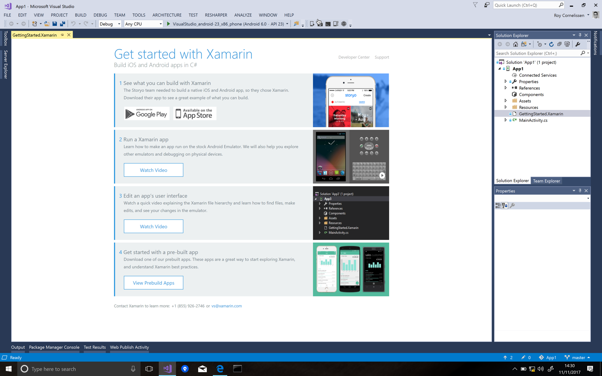
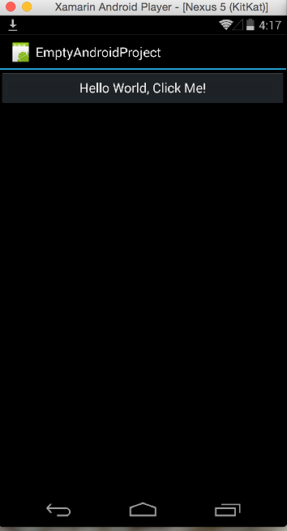
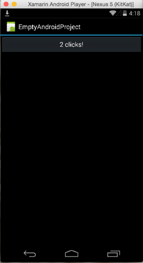
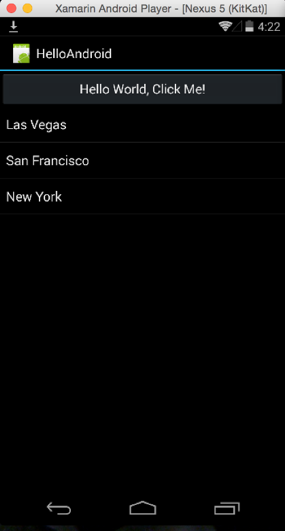
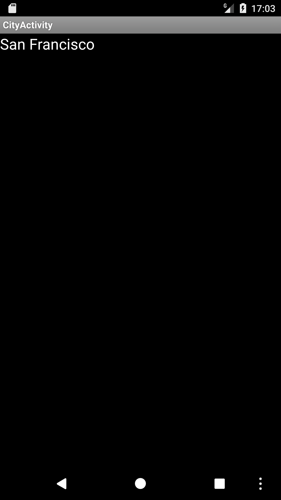
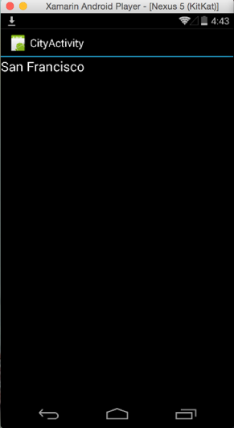

# Hello Android

## Objectives
- Build your first app with Xamarin.Android

## Instructions
Create a new Android project in Visual Studio 2017: `File > New Project > Android > Blank App (Android)` or in Visual Studio for Mac: `File > New Solution > Android > Blank Android App`.




The default Android project template already contains a working app. Examine its contents.
### MainActivity.cs
This is the root activity of the application, which starts up when the application launches.

```csharp
[Activity(Label = "App1", MainLauncher = true)]
public class MainActivity : Activity
{
    protected override void OnCreate(Bundle savedInstanceState)
    {
        base.OnCreate(savedInstanceState);

        // Set our view from the "main" layout resource
        SetContentView(Resource.Layout.Main);
    }
}
```

This **MainActivity** is marked with an attribute, indicating that it is the main launcher of the application.

Note that the Activity calls **SetContentView** to associate a layout. This layout named **“Main”** can be found in the _Resources\layout_ project folder as an .axml file.

### Resources\layout\Main.axml
Double-click the file. The Android designer will show up.


Clicking on the Source tab in the lower left corner will reveal the XML source.

```xml
<?xml version="1.0" encoding="utf-8"?>
<LinearLayout xmlns:android="http://schemas.android.com/apk/res/android"
    android:orientation="vertical"
    android:layout_width="match_parent"
    android:layout_height="match_parent" />
```

This main screen has a linear layout and contains no controls. In the **Designer** view, drag a button onto the surface from the **Toolbox**.


Notice in the properties pane that its **id** is `@+id/button1`. You can change this if you want, or just leave this as is.

### Interacting with controls
Return to the `MainActivity.cs` source file. After the call to `SetContentView(...)`, in the `OnCreate` method, add:

```csharp
var button = FindViewById<Button>(Resource.Id.button1);
```

This gives you a reference to the button you have just on the screen. `FindViewById` is a helper method for interacting with controls in your layout. The identifier `Resource.Id.button1` is generated from the layout AXML file when you compile the application or whenever you change something in an Android resource file.

After obtaining a reference to the button, you can manipulate the button and/or add event handlers. For example, you can add a handler for the Click event:

```csharp
// add a class level private field:
int count = 1;

// and place this code inside the OnCreate method:
button.Click += delegate { button.Text = string.Format("{0} clicks!", count++); };
```

Run the app and click on the button to see how it works.

 

### Adding a list
We are going to add a list to this application. Open the `Main.axml` layout and drag a `ListView` from the **Toolbox** to the surface just below the button.


Note that the `ListView` has id `@+id/listView1`.

Now add a data source to the project. To keep it simple, we’ll create a new class that holds a list of strings.

```csharp
public class Data
{
    public Data()
    {
        Cities = new List<string> {"Las Vegas", "San Francisco", "New York"};
    }
 
    public List<string> Cities { get; private set; } 
}
```

A `ListView` gets its data from an `Adapter`. For more advanced scenario’s, you can create your own adapter class, but we will use the `ArrayAdapter` that comes out of the box with the Android SDK.
In `MainActivity.cs`, replace the implementation of the `OnCreate` method with this:

```csharp
private Data _data = new Data();

protected override void OnCreate(Bundle bundle)
{
    base.OnCreate(bundle);
 
    // Set our view from the "main" layout resource
    SetContentView(Resource.Layout.Main);
 
    // Get our button from the layout resource,
    // and attach an event to it
    Button button = FindViewById<Button>(Resource.Id.button1);
 
    var listView = FindViewById<ListView>(Resource.Id.listView1);

    button.Click += delegate
    {
        var adapter = new ArrayAdapter(this, Android.Resource.Layout.SimpleListItem1);
 
        adapter.AddAll(_data.Cities);
        listView.Adapter = adapter;
    }; 
}
```

This code obtains a reference to the newly added `ListView`. In the `Click` handler for the button, an `ArrayAdapter` is created and bound to the `ListView`. Since this is a simple list containing only strings, the array is bound to the reserved `Android.Resource.Layout.SimpleListItem1` layout. This is a default item type in a ListView.

Note that the list of cities is copied into the adapter, and that the adapter is then bound to the `ListView` by setting its `Adapter` property.

Now if we run the app, the list will be populated when the button is clicked.



### Adding navigation
As a final step, we’re going to add navigation to the app. When we click on an item in the list, we will navigate to a new screen.

To add a new screen, we need a new activity and a new layout. First, create the new layout. Add a new item to the project in the `Resources\layout` folder, of type `Android Layout`. Name it `CityView.axml`.

Add a **“Text (Large)”** view from the Toolbox to the layout, or copy the XML definition below to the source. Note that the new text view has the ID `@+id/textView1`.

```xml
<?xml version="1.0" encoding="utf-8"?>
<LinearLayout xmlns:android="http://schemas.android.com/apk/res/android"
    android:orientation="vertical"
    android:layout_width="fill_parent"
    android:layout_height="fill_parent"
    android:minWidth="25px"
    android:minHeight="25px">
    <TextView
        android:text="Large Text"
        android:textAppearance="?android:attr/textAppearanceLarge"
        android:layout_width="match_parent"
        android:layout_height="wrap_content"
        android:id="@+id/textView1" />
</LinearLayout>
```

Add a new item to the project, of type `Android Activity`. Give it the name `CityActivity` and implement the `OnCreate` method like this:

```csharp
[Activity(Label = "CityActivity")]
public class CityActivity : Activity
{
    protected override void OnCreate(Bundle bundle)
    {
        base.OnCreate(bundle);
 
        // Bind a visual layout to this activity
        SetContentView(Resource.Layout.CityView);
 
        var text = FindViewById<TextView>(Resource.Id.textView1);
 
        // Get the city name that was passed to this activity in the Extras
        var city = Intent.Extras.Get("city").ToString();
        
        text.Text = city;
 
    }
}
```

Note that it uses the newly created layout as its content view.

Also note that it uses the `Intent.Extras` collection to obtain the name of the city that the user selected in the list and sets it to the `Text` property of the `TextView`.

In this last part, we’re going to launch the new activity and pass the city name. On Android, starting a new activity is always done through an `Intent`. 

The concept is that the user has an intent to perform a certain action. E.g.: send an email, show a map. Android could automatically select an activity that matches the intent, based on the user’s preferences, such as the default email app. In this way, the intent is decoupled from the actual activity that handles the intent.

We’re going to use these concepts to launch our new activity. In our case, the activity we want to launch is fixed though.

First add a `Click` handler to the `ListView` we added in the previous steps. In the `OnCreate` method of `MainActivity.cs`, add the following line:

```csharp
listView.ItemClick += ListViewOnItemClick;
```

Now add the `ListViewOnItemClick` event handler to the `MainActivity` class:

```csharp
private void ListViewOnItemClick(object sender, AdapterView.ItemClickEventArgs itemClickEventArgs)
{
    var intent = new Intent(this, typeof(CityActivity));
    intent.PutExtra("city", _data.Cities[itemClickEventArgs.Position]);
 
    StartActivity(intent);
}
```

This method creates a new `Intent`, specifying the type of the newly added `CityActivity` class. Note that it adds an item to the `Extras` collection using the `PutExtra` method. The item is named “city” and contains the name of the city that the user selected in the list. The `Position` property of the `itemClickEventArgs` is used as an indexer for the list of cities to retrieve the actual value.

`StartActivity` launches the activity, using the intent we just created. Run the app to see it work:

 

# Congratulations!
You've built your first Xamarin.Android app.